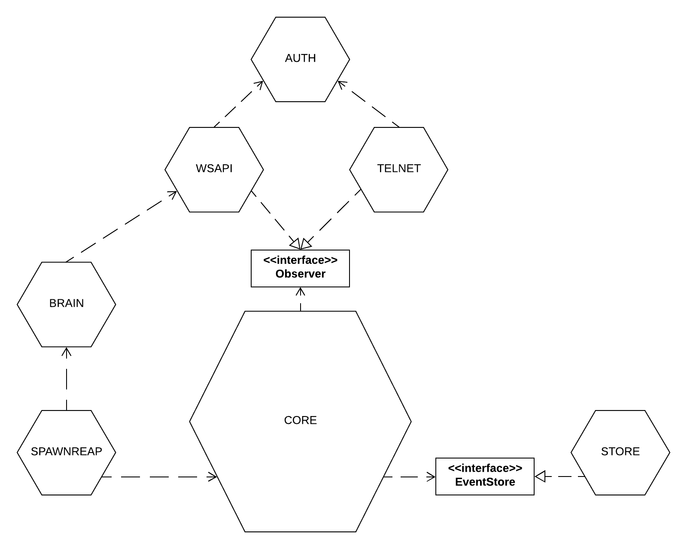
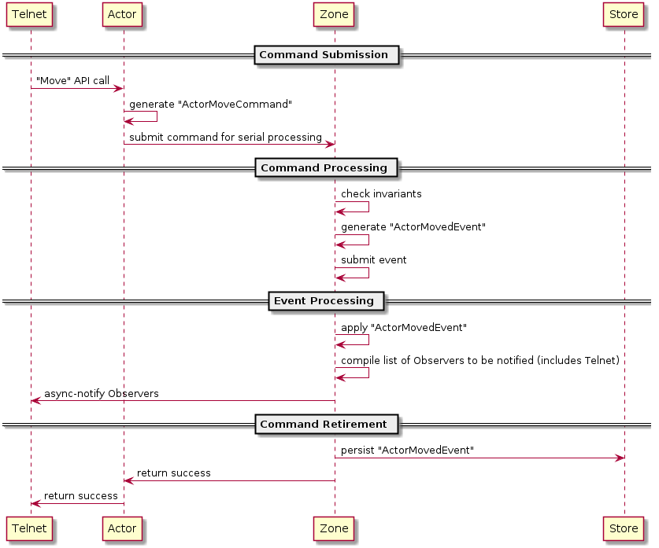

# Table of contents
* [Design principles](#design-principles)
   * [Event sourced core](#event-sourced-core)
   * [Isolated core](#isolated-core)
   * [Isolated, parallel execution/data contexts](#isolated-parallel-executiondata-contexts)
   * [Commands versus events](#commands-versus-events)
* [Design patterns](#design-patterns)
   * [Goroutines as services](#goroutines-as-services)
* [Package structure](#package-structure)
   * [Package-by-package overview](#package-by-package-overview)
   * [Dependencies](#dependencies)
* [Execution flow](#execution-flow)
   * [Example Telnet->Core flow](#example-telnet-core-flow)

# Design principles
## Event sourced core
The core of the MUD is [event sourced](https://martinfowler.com/eaaDev/EventSourcing.html), meaning that
its data is stored as a stream of changes to state, rather than a single final state. This offers the
following benefits:
1. It's _conceptually_ natural for a MUD, since the code for the game as well as the gameplay
  experience itself is a series of events. That is, it makes most sense to read it like a novel
  with a plot that progresses over time, rather than like a spreadsheet, where only the current
  state is significant.
1. It's a natural fit for integrating with external AI processes, which necessarily must be kept
  up to date with events and changes in the environment.
1. It lends itself to replication, e.g. for a parallel MUD used for destructive experiments, or for
  backups.
1. It lends itself to debugging production problems outside of production.
   * Given a snapshot + subsequent event stream leading up to a problem, the exact state in which the
     problem occured can be reconstructed in an offline / non-live environment.

But, it also has these significant drawbacks:
1. It's somewhat unnatural for a game engine.
   * Games are usually expected to produce/process truly _huge_ amounts of change, and anything other
      than instantaneous state is rarely interesting for _players_. So the strengths of event-sourcing
      are, in short, not very compelling for a game.
1. It's not very performant, compared to the "normal" approach for a game engine.
   * Most game engines achieve cache-coherency by processing changes in discrete "ticks" of time. By
   grouping changes into ticks, the engine can bucket and process certain types of change together.
   For example, it can process all movement in a single loop, then process all collision-detections,
   and so on. This gives code-cache coherency, since the same code is being executed over and over.
   Further, since all changes of a single type are concerned with the same types of inputs, all of
   those inputs can be grouped together too-- e.g., all "locations" for all NPCs can be stored together
   in a big array, with each "location" having a pointer back to its NPC-- granting data-cache coherency
   as the code loops through all of them.
   * Processing changes one command at a time breaks our ability to bucket changes and their related
   inputs, so we lose the opportunity for those (fairly massive) optimizations.
1. It's more complex to reason about than straight-line X-then-Y-then-Z procedural code; we have to
   ask ourselves questions such as "_how granular should our events be?_", which is similar to "_how
   granular should our functions be?_" but it has *much* deeper implications because changing events after
   the fact is essentially a database schema change.

## Isolated core
The core of the system is aggressively isolated, to permit experimentation both within and outside its
boundaries without causing ripples throughout the codebase.

The strongest example of this isolation is that callers outside of `core` actually cannot see that it is
event-sourced-- they know that commands go in and events come out, but there is no evidence that
`core`[1] is using the events themselves as a storage mechanism for its state.

The best example (to date) of this paying off has been several complete re-works of the internal flow
of command/event data within `core`. Because the exposed methods do not reveal commands/events, during
development I was able to completely change the data-flow and internal responsibilities for generating,
processing, and retiring them within `core` while making zero changes to either `telnet` or `wsapi`, on
more than one occasion.

[1] Actually, the `-debug` mode for the main binary very much does know about it being event-sourced,
but that's forgivable for a debugging tool.

## Isolated, parallel execution/data contexts
To take advantage of today's multi-core CPUs, and possibly to allow scaling to more than one physical
machine for running a single instance of the MUD, `core` takes care to group closely-related entities
into [aggregates](https://martinfowler.com/bliki/DDD_Aggregate.html) which can be modified concurrently
while maintaining all invariants internally.

The aggregate-unit in the MUD is a `core.Zone`, which corresponds roughly to a collection of
`core.Location` objects, and all of the `Actor`, `Exit`, and `Object` instances found in those locations.
These must be grouped together so that, e.g. if an Actor moves from one Location to another, both the
original and the new Location will agree that the Actor has exactly 1 current location (not 0, not 2).

It is possible for Actors and Objects to migrate between Zones; this is handled using eventual-consistency
by the `core.World`, which allows brief inconsistency (an Actor/Object is briefly found in _neither_
the source or destination Zone as it migrates). It also uses an intent-log to ensure that, should the
MUD crash during that moment of inconsistency, it will be returned to a consistent state upon restart.

But, outside of cross-Zone migrations, all changes take place within a single Zone, and changes happening
in different Zones cannot / do not interact with one another and thus can happen in a truly concurrent
fashion. 

## Commands versus events
A "_command_" is an instruction to _do something_. That something may not even be possible, and if it is
then it may trigger any number of changes within the state of the system. The code is free to treat
commands as rejectable, re-orderable, or even re-interpretable. A command is almost always / only
ever the direct result of an API call intended to cause a change in the system.

An "_event_" is a record of something which _has already happened_. It is non-negotiable; it's happened,
so it's too late to perform invariant-checking. We must instead to the greatest extent possible update
our state / invoke whatever is needed to honor the event. Put differently, an event is akin to a database
row-- the data in the row might be corrupt, but it **definitely exists**.

One interesting category of events is records of interactions with external systems (the MUD currently
has no such instances, but I record the design-intent here for when it comes up). If we must make a call
to an external system, we should record+persist the result of that call as an **event**, _even/especially
if the result is an error_. This ensures that we can reconstruct that exact state again in isolation,
without running instances of those external services.

An interesting category of commands is notifications of events from other systems. Even for an external
"event" we are definitely interested in, if honoring that "event" would force us to violate our own
invariants then we must reject it. As [Martin Fowler put it](https://martinfowler.com/articles/201701-event-driven.html),
in this case the "_event is used as a passive-aggressive command_"-- they've told us about their updated
state and expect us to update ours, but we're not actually bound to do that on our end even though the
event is non-negotiable on their end.

# Design patterns
## Goroutines as services
Throughout the code you'll see the below RPC-like pattern, hidden behind a procedural API:
```go
// boilerplate; this is actually defined in the `rpc` package
type requestOrUpdate struct {
	updateState bool
	newState MyServiceState
	responseChan chan response
}
type response struct {
	state MyServiceState
	err error
}

// our state definition
type MyServiceState struct {
	// ...
}

// the actual code
type MyService struct{
	state MyServiceState
	requestChan chan requestOrUpdate
	stopChan chan struct{}
}

func (ms *MyService) Start() {
	ms.requestChan = make(chan requestOrUpdate)
	ms.stopChan = make(chan struct{})
	go ms.mainLoop()
}

func (ms *MyService) Stop() {
	close(ms.stopChan)
}

func (ms *MyService) mainLoop() {
    for {
        select {
        // when Stop() is called, stop looping on this function
        case <-ms.stopChan:
            return
        // otherwise, respond to requests/updates
        case req := <-ms.requestChan:
            if req.updateState {
                ms.state = req.NewState
                req.responseChan <- response{}
                close(req.responseChan)
            } else {
                req.responseChan <- response {
                    state: ms.state,
                }
                close(req.responseChan)
            }
        }
    }
}

func (ms *MyService) Update(newState MyServiceState) error {
	responseChan := make(chan response)
	req := requestOrUpdate {
		updateState: true,
		newState: newState,
		responseChan: responseChan,
	}
	ms.requestChan <- req
	response := <-responseChan
	return response.err
}

func (ms *MyService) Query() (MyServiceState, error) {
	responseChan := make(chan response)
	req := requestOrUpdate {
		updateState: false,
		responseChan: responseChan,
	}
	ms.requestChan <- req
	response := <-responseChan
	return response.state, response.err
}
```

The most important thing to note is how the public API calls don't reveal the internal use of goroutines
or channels at all-- it's all hidden behind the API.

I say "_the most important thing_" because this example is actually overly simple, and would probably
be better implemented using `sync.RWLock` rather than a goroutine+channels. In particular, this pattern
can make things **worse** if any of the code called by `MyService.mainLoop()` might block, as that
introduces a risk for deadlock that wasn't there before (e.g. if the routine that calls `Update()` ends
up blocking the routine running `mainLoop()`, we have a deadlock where the use of `sync.RWLock` probably
would have avoided it).

The pattern **is** usefully applied when:
* we have things that are naturally different processes, rather than just different areas of concern
   * e.g. a process for reading/writing to a network socket, which nearly always blocks, and another
     process for constantly recomputing AI decisions
* we have some code which-- should it crash-- should tear down all access to a protected resource, rather
  than possibly leaving it in an inconsistent state for the next lock-holder
    * e.g. if `core.Zone` somehow releases a lock and then panics due to a subtle bug, it's better to
      prevent any subsequent caller from getting at the data in the Zone. If we wrap all access in a
      goroutine, we ensure no further changes will be serviced-- it's dead. If we wrap it in a
      `sync.RWLock`, then just one wsapi / telnet client is dead, and everyone else will continue to
      touch the now-dirty data.

Anyway, back to the important bit: by hiding all of that behind the API, we could easily change our
implementation back/forth from `sync.RWLock` to this goroutine-as-a-service pattern without our
consumers knowing about it. So, getting that right is important-- getting the implementation right
is less so.

# Package structure
## Package-by-package overview
* `auth`
   * A callable authentication / authorization database.
   * Authentication is implemented using usernames+passwords; passwords are stored as bcrypt hashes.
   * Authorization is implemented as a set of permissions, e.g. `mayLogin`, which is returned as
     a single descriptor for a given account.
   * Main entry point is `auth.Server`
* `brain`
   * Spawns AI processes to control NPCs / monsters.
   * Main entry point is `brain.Service`
* `cmd`
   * Per go-idioms, contains executables.
   * Main binary for the project is _cmd/mud-daemon_.
* `commands`
   * Implements several `core.Command`-builder routines common to both `telnet` and `wsapi`.
* `core`
   * Implements the core objects and behaviors for the MUD.
   * First entry point is `core.World.LoadAndStart()`.
   * Most write-operations will be made by calling public methods on `core.Actor`.
   * Most read-operations will be made by calling public methods on `core.Actor`, `core.Exit`,
     `core.Location`, and `core.Object`.
* `rpc`
   * Defines request/response data types for simple bi-directional, synchronous comms across
     Go-channels.
* `spawnreap`
   * Implements periodic activities for the MUD, primarily by making API calls into `core`.
      * E.g. spawning new monsters, decaying old items by making API calls into `core`.
      * E.g. requesting AI processes for monsters by making API calls into `brain`.
* `store`
   * Implements persistence for streams of `core.Event` objects. 
* `telnet`
   * Implements a traditional text-based UI over the Telnet protocol (RFC 1123), translating user
     input into commands for `core`, and translating `core.Event` responses into human-readable
     output.
   * Main entry point is `telnet.Server`.
* `uuid`
   * Helper routines for `github.com/satori/go.uuid` calls.
* `wsapi`
   * Implements a websocket (RFC 6455)-transported API / protocol, with clients submitting 
     queries and commands to the server, and receiving `core.Event` objects and responses
     multiplexed over a single bi-directional channel.
   * Main entry point is `wsapi.Server`.

## Dependencies


# Execution flow
### Example Telnet->Core flow


